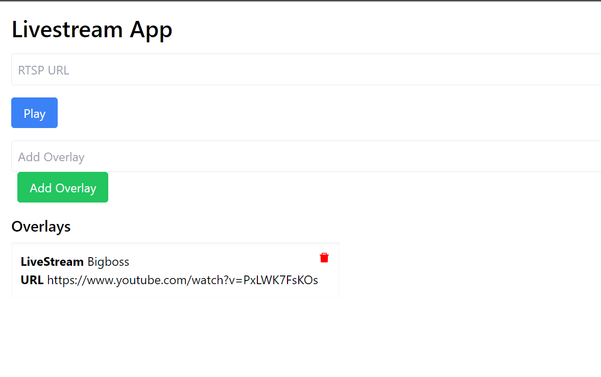
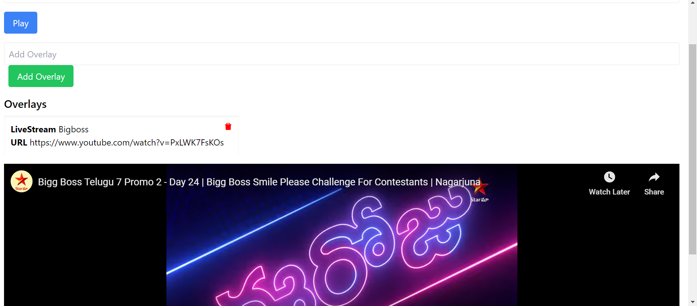
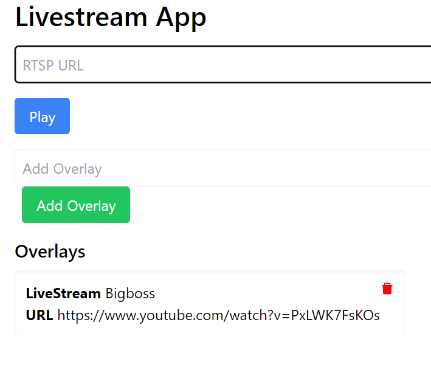
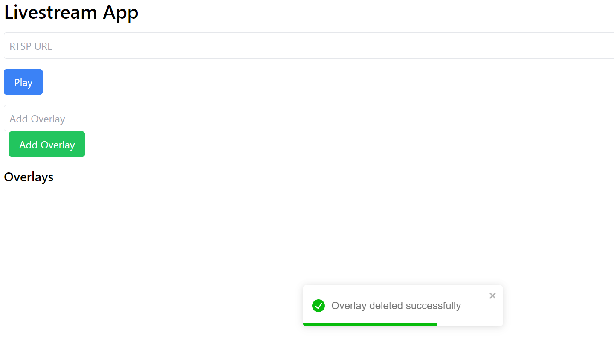

# LiveStream
This is Livestream App used to display video by entering url as input, We can pause and play video using the button.

Here I entered url immediately we can see video at bottom.

We can add this Livestream as overlay and it sends request to backend flask end point, in this endpoint content, url as inputs from request these are stored in mongodb database collection.

By using redux-toolkit here immediately we can see the added overlay with help of calling getOverlays() slice after addOverlays() slice.

We can delete this previous overlay by simply clicking delete icon.

This is all about adding Live stream video by url and performing actions on it and this application is fully responsive.